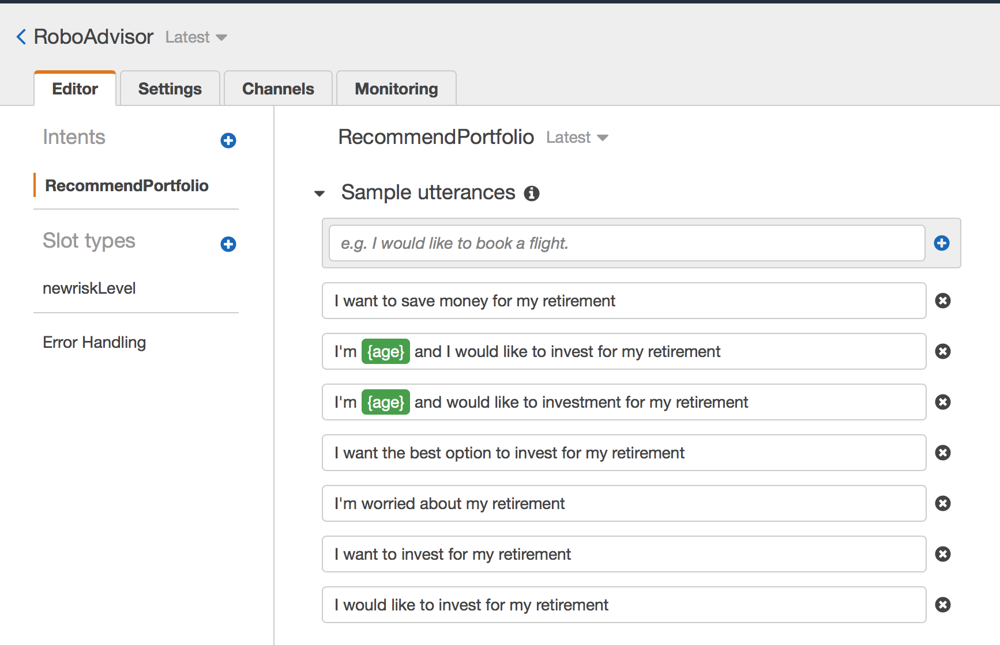

# Unit 13 Homework Assignment - The Power of the Cloud and Unsupervised Learning

## Robo Advisor for Retirement Plans

### Background

I wwas hired as a digital transformation consultant by one of the most prominent retirement plan providers in the country; they want to increase their client portfolio, especially by engaging young people. Since machine learning and NLP are disrupting finance to improve customer experience, I decided to create a robo advisor that could be used by customers or potential new customers to get investment portfolio recommendations for retirement using Slack.

This code will demonstrate the use of Amazon Web Services with Python, to create a bot that will recommend an investment portfolio for a retirement plan.

The approach consists of the following main steps:

1. **[Initial Robo Advisor Configuration:](#Initial-Robo-Advisor-Configuration)** Define an Amazon Lex bot with a single intent that establishes a conversation about the requirements to suggest an investment portfolio for retirement.

2. **[Build and Test the Robo Advisor](#Build-and-Test-the-Robo-Advisor):** Make sure that your bot is working and responding accurately along with the conversation with the user, by building and testing it.

3. **[Deploy the Robo Advisor on Slack](#Deploy-the-Robo-Advisor-on-Slack):** Publish the bot and create a Robo Advisor Slack app.

4. **[Enhance the Robo Advisor with an Amazon Lambda Function:](#Enhance-the-Robo-Advisor-with-an-Amazon-Lambda-Function)** Create an Amazon Lambda function that validates the user's input and returns the investment portfolio recommendation. This task includes testing the Amazon Lambda function and making the integration with the bot.

5. **Deploy the Robo Advisor Powered by Amazon Lambda:** Publish a new version of your bot that includes the new Amazon Lambda function, also test the new version of your bot on Slack.

---

### Files

* [lambda_function.py](Starter_Files/lambda_function.py)
* [correct_dialog.txt](Test_Cases/correct_dialog.txt)
* [age_error.txt](Test_Cases/age_error.txt)
* [incorrect_amount_error.txt](Test_Cases/incorrect_amount_error.txt)
* [negative_age_error.txt](Test_Cases/negative_age_error.txt)

---

### Instructions

#### Initial Robo Advisor Configuration

Created the `RoboAdvisor` bot and added an intent with its corresponding slots using the following parameters:

* **Bot name:** RoboAdvisor
* **Output voice**: Salli
* **Session timeout:** 5 minutes
* **COPPA**: No

Created the `RecommendPortfolio` intent, and configured utterances as follows:

* I want to save money for my retirement
* I'm ​`{age}​` and I would like to invest for my retirement
* I'm `​{age}​` and I want to invest for my retirement
* I want the best option to invest for my retirement
* I'm worried about my retirement
* I want to invest for my retirement
* I would like to invest for my retirement

Moved to the *Confirmation Prompt* section, and set the following messages:

* **Confirm:** Thanks, now I will look for the best investment portfolio for you.
* **Cancel:** I will be pleased to assist you in the future.

I used four slots for this bot, three using built-in types and one custom slot named `riskLevel`.

| Name             | Slot Type            | Prompt                                                                    |
| ---------------- | -------------------- | ------------------------------------------------------------------------- |
| firstName        | AMAZON.US_FIRST_NAME | Thank you for trusting on me to help, could you please give me your name? |
| age              | AMAZON.NUMBER        | How old are you?                                                          |
| investmentAmount | AMAZON.NUMBER        | How much do you want to invest?                                           |

The `riskLevel` custom slot will be used to retrieve the risk level the user is willing to take on the investment portfolio; create this custom slot as follows:

* **Name:** riskLevel
* **Prompt:** What level of investment risk would you like to take?
* **Maximum number of retries:** 2
* **Prompt response cards:** 4

Configured the response cards for the `riskLevel` slot as is shown bellow:

Leave the error handling configuration for the `RecommendPortfolio` bot with the default values.

#### Build and Test the Robo Advisor

Finally, I built the bot and tested it on the chatbot window. You should see a conversation like the one below.

#### Deploy the Robo Advisor on Slack

After confirming that my Robo Advisor was working, the mission was to publish the first version of the bot and configure the connection to Slack.

Unfortunately, I was unable to deploy the bot to Slack after working with the instructors a few times. Since my bot was tested and working in AWS, they recommended I skip this portion.

#### Enhance the Robo Advisor with an Amazon Lambda Function

Next I created an Amazon Lambda function that validated the data provided by the user on the Robo Advisor. I Started by creating a new lambda function from scratch and name it `recommendPortfolio`. Select Python 3.7 as runtime. See lambda file for code.

* The `age` should be greater than zero and less than 65.
* the `investment_amount` should be equals o greater than 5000.

##### Investment Portfolio Recommendation

Once the intent is fulfilled, the bot will responsd with an investment recommendation based on the selected risk level as follows:

* **none:** "100% bonds (AGG), 0% equities (SPY)"
* **very low:** "80% bonds (AGG), 20% equities (SPY)"
* **low:** "60% bonds (AGG), 40% equities (SPY)"
* **medium:** "40% bonds (AGG), 60% equities (SPY)"
* **high:** "20% bonds (AGG), 80% equities (SPY)"
* **very high:** "0% bonds (AGG), 100% equities (SPY)"

#### Deploy the Robo Advisor Powered by Amazon Lambda

Now the bot is ready to advise customers about retirement plans on Slack. 

